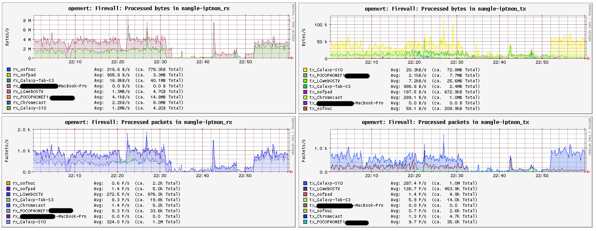

# iptmon: Simple iptables bandwidth monitor



`iptmon` is a script used to create and update `iptables` firewall rules to count transmit and recieve traffic to/from each host. It is intended to be triggered by dnsmasq using the `--dhcp-script` option, so that as new hosts are added and old leases expire, rules are updated dynamically.

Packet and byte counts can then be scraped by `collectd` using the `iptables` plugin. See `etc/collectd/conf.d/iptables.conf` for configuration example.

Furthermore, `collectd` can push data to InfluxDB, which can in turn be used as a data source for [Grafana dashboards](https://github.com/oofnikj/docker-openwrt/tree/master/monitoring).

Inspired by [wrtbmon](https://github.com/pyrovski/wrtbwmon).

---

To make use of `iptmon`, you should already be using `luci-app-statistics` and `collectd` to collect and process metrics.

The `iptables` module can be used to collect per-host metrics.


## Installation on OpenWRT
Copy files from host:
```
$ scp etc/collectd/conf.d/iptables.conf ${OPENWRT_HOST}:/etc/collectd/conf.d/
$ scp usr/sbin/iptmon ${OPENWRT_HOST}:/usr/sbin/
```

### on OpenWRT

Configure `dnsmasq` to trigger `iptmon`:
```
# echo 'dhcp-script=/usr/sbin/iptmon' >> /etc/dnsmasq.conf
```

Add init command to firewall startup:
```
# echo '/usr/sbin/iptmon init' >> /etc/firewall.user
```

Set include dir for `collectd`:
```
# uci set luci_statistics.collectd.Include='/etc/collectd/conf.d'
# uci commit
# service luci_statistics restart
```

## removal
To uninstall, run `iptmon remove`. This will restore your `mangle` table to the state it was in before you ran `iptmon init`.